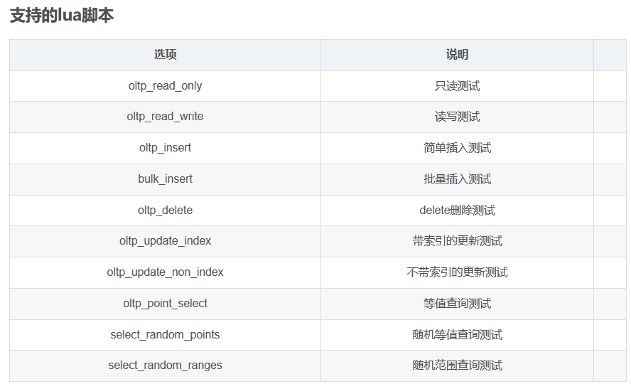

# 一、使用sysbench工具进行测试

## 1.1 工具说明
&emsp;&emsp;sysbench是一个开源的、模块化的、跨平台的多线程性能测试工具，可以用来进行CPU、内存、磁盘I/O、线程、数据库的性能测试。目前支持的数据库有MySQL、Oracle和PostgreSQL。

sysbench的测试可运用：

- CPU性能
- 磁盘IO性能
- 调动程序性能
- 内存分配及传输速度
- POSIX线程性能
- 数据库性能

## 1.2 安装说明

## 1.3 使用方法

        &emsp;&emsp;输入 sysbench --help 来查看帮助信息

```
wang@wang-virtual-machine:~$ sysbench --help
Usage:
 sysbench [options]... [testname] [command]
Commands implemented by most tests: prepare run cleanup help
General options:
 --threads=N number of threads to use [1]
 --events=N limit for total number of events [0]
 --time=N limit for total execution time in seconds [10]
 --forced-shutdown=STRING number of seconds to wait after the --time limit before forcing shutdown, or 'off' to disable [off]
 --thread-stack-size=SIZE size of stack per thread [64K]
 --rate=N average transactions rate. 0 for unlimited rate [0]
 --report-interval=N periodically report intermediate statistics with a specified interval in seconds. 0 disables intermediate reports [0]
 --report-checkpoints=[LIST,...] dump full statistics and reset all counters at specified points in time. The argument is a list of comma-separated values representing the amount of time in seconds elapsed from start of test when report checkpoint(s) must be performed. Report checkpoints are off by default. []
 --debug[=on|off] print more debugging info [off]
 --validate[=on|off] perform validation checks where possible [off]
 --help[=on|off] print help and exit [off]
 --version[=on|off] print version and exit [off]
 --config-file=FILENAME File containing command line options
 --tx-rate=N deprecated alias for --rate [0]
 --max-requests=N deprecated alias for --events [0]
 --max-time=N deprecated alias for --time [0]
 --num-threads=N deprecated alias for --threads [1]
Pseudo-Random Numbers Generator options:
 --rand-type=STRING random numbers distribution {uniform,gaussian,special,pareto} [special]
 --rand-spec-iter=N number of iterations used for numbers generation [12]
 --rand-spec-pct=N percentage of values to be treated as 'special' (for special distribution) [1]
 --rand-spec-res=N percentage of 'special' values to use (for special distribution) [75]
 --rand-seed=N seed for random number generator. When 0, the current time is used as a RNG seed. [0]
 --rand-pareto-h=N parameter h for pareto distribution [0.2]
Log options:
 --verbosity=N verbosity level {5 - debug, 0 - only critical messages} [3]
 --percentile=N percentile to calculate in latency statistics (1-100). Use the special value of 0 to disable percentile calculations [95]
 --histogram[=on|off] print latency histogram in report [off]
General database options:
 --db-driver=STRING specifies database driver to use ('help' to get list of available drivers) [mysql]
 --db-ps-mode=STRING prepared statements usage mode {auto, disable} [auto]
 --db-debug[=on|off] print database-specific debug information [off]
Compiled-in database drivers:
 mysql - MySQL driver
 pgsql - PostgreSQL driver
mysql options:
 --mysql-host=[LIST,...] MySQL server host [localhost]
 --mysql-port=[LIST,...] MySQL server port [3306]
 --mysql-socket=[LIST,...] MySQL socket
 --mysql-user=STRING MySQL user [sbtest]
 --mysql-password=STRING MySQL password []
 --mysql-db=STRING MySQL database name [sbtest]
 --mysql-ssl[=on|off] use SSL connections, if available in the client library [off]
 --mysql-ssl-cipher=STRING use specific cipher for SSL connections []
 --mysql-compression[=on|off] use compression, if available in the client library [off]
 --mysql-debug[=on|off] trace all client library calls [off]
 --mysql-ignore-errors=[LIST,...] list of errors to ignore, or "all" [1213,1020,1205]
 --mysql-dry-run[=on|off] Dry run, pretend that all MySQL client API calls are successful without executing them [off]
pgsql options:
 --pgsql-host=STRING PostgreSQL server host [localhost]
 --pgsql-port=N PostgreSQL server port [5432]
 --pgsql-user=STRING PostgreSQL user [sbtest]
 --pgsql-password=STRING PostgreSQL password []
 --pgsql-db=STRING PostgreSQL database name [sbtest]
Compiled-in tests:
 fileio - File I/O test
 cpu - CPU performance test
 memory - Memory functions speed test
 threads - Threads subsystem performance test
 mutex - Mutex performance test
See 'sysbench <testname> help' for a list of options for each test.
```

# 二、测试cpu性能

## 2.1 测试原理

        &emsp;&emsp;sysbench的cpu测试是在指定时间内，循环进行素数计算。而质数是在大于1的自然数中，除了1和它本身以外，不能被其他自然数整除的数。

## 2.2 测试命令

        &emsp;&emsp;我们输入 sysbench --test=cpu help 查看cpu测试的帮助信息    

```
wang@wang-virtual-machine:~$ sysbench --test=cpu help
WARNING: the --test option is deprecated. You can pass a script name or path on the command line without any options.
sysbench 1.0.20 (using system LuaJIT 2.1.0-beta3)
cpu options:
 --cpu-max-prime=N upper limit for primes generator [10000]
```

### --cpu-max-prim：生成素数的上限

&emsp;&emsp;若设置为3，则表示2、3、5（这样要计算1-5共5次）

  &emsp;&emsp;若设置为10，则表示2、3、5、7、11、13、17、19、23、29（这样要计算1-29共29次）

 &emsp;&emsp;默认值为10000

### --threads：线程数

&emsp;&emsp;若设置为1，则sysbench仅启动1个线程进行素数的计算

&emsp;&emsp;若设置为2，则sysbench会启动2个线程，同时分别进行素数的计算

&emsp;&emsp; 默认值为1

### --time: 运行时长，单位秒

&emsp;&emsp;若设置为5，则sysbench会在5秒内循环往复进行素数计算，从输出结果可以看到在5秒内完成了几次，比如配合--cpu-max-prime=3，则表示第一轮算得3个素数，如果时间还有剩就再进行一轮素数计算，直到时间耗尽。每完成一轮就叫一个event默认值为10

  相同时间，比较的是谁完成的event多，完成的越多越好

### --events: event上限次数

 &emsp;&emsp;若设置为100，则表示当完成100次event后，即使时间还有剩，也停止运行

 &emsp;&emsp;默认值为0，则表示不限event次数

 &emsp;&emsp;相同event次数，比较的是谁用时更少

## 2.3 测试结果

        &emsp;&emsp;我们输入测试命令

```
sysbench --test=cpu --cpu-max-prime=10000 --time=60 --threads=1 --events=0 run
```

        &emsp;&emsp;表示测试素数上限为10000，测试时间为60秒，开启一个线程，上限次数为不限

&emsp;&emsp;测试结果为：

```
wang@wang-virtual-machine:~$ sysbench --test=cpu --cpu-max-prime=10000 --time=60 --threads=1 --events=0 run
WARNING: the --test option is deprecated. You can pass a script name or path on the command line without any options.
sysbench 1.0.20 (using system LuaJIT 2.1.0-beta3)
Running the test with following options:
Number of threads: 1
Initializing random number generator from current time
Prime numbers limit: 10000
Initializing worker threads...
Threads started!
CPU speed:
 events per second: 1254.93
General statistics:
 total time: 60.0005s
 total number of events: 75298
Latency (ms):
 min: 0.72
 avg: 0.80
 max: 19.51
 95th percentile: 1.01
 sum: 59942.23
Threads fairness:
 events (avg/stddev): 75298.0000/0.00
 execution time (avg/stddev): 59.9422/0.00
```

        &emsp;&emsp;我们分析一下结果，cpu speed表示在1到10000是每轮， 所有线程每秒完成了1254.93轮。total time表示总用时60.0005s。
       &emsp;&emsp; total number of events表示总共完成了75298轮。

        &emsp;&emsp;latency中，每轮中最少耗时0.72ms，平均0.80ms，最大19.51ms，前95％都是在1.01ms完成，每个线程59942.23ms。

        &emsp;&emsp;Threads fairness中，每个线程完成75298.0000次，标准差是0，每个线程平均耗时59.9422，标准差为0。

## 2.4 cpu性能评判标准

&emsp;&emsp;如果有2台服务器进行CPU性能对比，当素数上限和线程数一致时： 

- 相同时间，比较event
- 相同event，比较时间
- 时间和event都相同，比较stddev(标准差)

# 三、测试内存性能

## 3.1 测试原理

​         &emsp;&emsp;sysbench内存性能测试，主要是针对不同大小的块进行连续读写或者随机读写操作。在内存性能测试中，events指的是读/写一个内存块。

## 3.2 测试命令

        &emsp;&emsp;输入sysbench --test=memory help查看帮助信息

```
memory options:
  --memory-block-size=SIZE    # 内存块大小 [1K]
  --memory-total-size=SIZE    # 传输数据的总大小 [100G]
  --memory-scope=STRING       # 内存访问范围 {global,local} [global]
  --memory-hugetlb[=on|off]   # 从HugeTLB池中分配内存 [off]
  --memory-oper=STRING        # 内存操作类型 {read, write, none} [write]
  --memory-access-mode=STRING # 内存访问模式 {seq,rnd} [seq]
```

## 3.3 测试结果

        &emsp;&emsp;我们输入命令：

```
sysbench --test=memory --threads=1 --time=30 --report-interval=1 --memory-block-size=1024K --memory-total-size=100G --memory-access-mode=seq run
```

         &emsp;&emsp;线程数=1，测试总用时，每1s输出一次中间结果，内存块大小=1024K，传输数据总量=100G，内存访问模式=顺序访问 内存操作=写，最终的测试结果为：

```
Running the test with following options:
Number of threads: 1
Report intermediate results every 1 second(s)
Initializing random number generator from current time


Running memory speed test with the following options:
  block size: 1024KiB
  total size: 102400MiB
  operation: write
  scope: global

Initializing worker threads...

Threads started!

[ 1s ] 21083.29 MiB/sec
[ 2s ] 21538.45 MiB/sec
[ 3s ] 21049.74 MiB/sec
[ 4s ] 20864.72 MiB/sec
Total operations: 102400 (21045.02 per second)

102400.00 MiB transferred (21045.02 MiB/sec)


General statistics:
    total time:                          4.8646s
    total number of events:              102400

Latency (ms):
         min:                                    0.04
         avg:                                    0.05
         max:                                    1.44
         95th percentile:                        0.06
         sum:                                 4834.14

Threads fairness:
    events (avg/stddev):           102400.0000/0.00
    execution time (avg/stddev):   4.8341/0.00
```

# 四、磁盘io性能测试

## 4.1 测试原理

        &emsp;&emsp;I/O 的概念，从字义来理解就是输入输出。操作系统从上层到底层，各个层次之间均存在 I/O。比如，CPU 有 I/O，内存有 I/O, VMM 有 I/O, 底层磁盘上也有 I/O，这是广义上的 I/O。通常来讲，一个上层的 I/O 可能会产生针对磁盘的多个 I/O，也就是说，上层的 I/O 是稀疏的，下层的 I/O 是密集的。  
&emsp;&emsp;磁盘的 I/O，顾名思义就是磁盘的输入输出。输入指的是对磁盘写入数据，输出指的是从磁盘读出数据。我们常见的磁盘类型有 ATA、SATA、FC、SCSI、SAS。

        &emsp;&emsp;IOPS (Input/Output Per Second)即每秒的输入输出量(或读写次数)，是衡量磁盘性能的主要指标之一。IOPS是指单位时间内系统能处理的I/O请求数量，I/O请求通常为读或写数据操作请求。随机读写频繁的应用，如OLTP(Online Transaction Processing)，IOPS是关键衡量指标。另一个重要指标是数据吞吐量(Throughput)，指单位时间内可以成功传输的数据数量。对于大量顺序读写的应用，如VOD(Video On Demand)，则更关注吞吐量指标。

## 4.2 测试命令

        &emsp;&emsp;输入sysbench fileio help

```
sysbench 1.0.20 (using system LuaJIT 2.1.0-beta3)

fileio options:
  --file-num=N                  number of files to create [128]
  --file-block-size=N           block size to use in all IO operations [16384]
  --file-total-size=SIZE        total size of files to create [2G]
  --file-test-mode=STRING       test mode {seqwr, seqrewr, seqrd, rndrd, rndwr, rndrw}
  --file-io-mode=STRING         file operations mode {sync,async,mmap} [sync]
  --file-async-backlog=N        number of asynchronous operatons to queue per thread [128]
  --file-extra-flags=[LIST,...] list of additional flags to use to open files {sync,dsync,direct} []
  --file-fsync-freq=N           do fsync() after this number of requests (0 - don't use fsync()) [100]
  --file-fsync-all[=on|off]     do fsync() after each write operation [off]
  --file-fsync-end[=on|off]     do fsync() at the end of test [on]
  --file-fsync-mode=STRING      which method to use for synchronization {fsync, fdatasync} [fsync]
  --file-merged-requests=N      merge at most this number of IO requests if possible (0 - don't merge) [0]
  --file-rw-ratio=N             reads/writes ratio for combined test [1.5]
```

&emsp;&emsp;一些参数的解释如下

- --file-num 文件数，默认128，iops会随着文件数增大而减小
- --file-extra-flags 打开文件方式
- --file-fsync-freq 完成多少次写入磁盘，默认 100
- --file-test-mode 写入方式{seqwr, seqrewr, seqrd, rndrd, rndwr, rndrw}
- --file-block-size 用于所有IO操作的块大小，默认 16k
- --file-io-mode 同步方式，同步或异步等

## 4.3 测试结果

        &emsp;&emsp;我们先进行数据的准备，输入命令

```bash
sysbench fileio --file-num=1 --file-total-size=2G --file-test-mode=rndrw --events=0 prepare
```

        &emsp;&emsp;终端显示下列内容，说明我们已经准备成功了

```
sysbench 1.0.20 (using system LuaJIT 2.1.0-beta3)

1 files, 2097152Kb each, 2048Mb total
Creating files for the test...
Extra file open flags: (none)
Creating file test_file.0
2147483648 bytes written in 2.07 seconds (989.43 MiB/sec). 
```

        &emsp;&emsp;现在进行执行

```bash
sysbench fileio  --file-num=1  --file-total-size=2G  --time=100  --file-extra-flags=direct  --file-io-mode=async --file-fsync-freq=0  --report-interval=3  --file-test-mode=rndrw  --file-block-size=16K run
```

        &emsp;&emsp;执行的结果如下：

```
sysbench 1.0.20 (using system LuaJIT 2.1.0-beta3)

Running the test with following options:
Number of threads: 1
Report intermediate results every 3 second(s)
Initializing random number generator from current time


Extra file open flags: directio
1 files, 2GiB each
2GiB total file size
Block size 16KiB
Number of IO requests: 0
Read/Write ratio for combined random IO test: 1.50
Calling fsync() at the end of test, Enabled.
Using asynchronous I/O mode
Doing random r/w test
Initializing worker threads...

Threads started!

[ 3s ] reads: 324.42 MiB/s writes: 215.84 MiB/s fsyncs: 0.00/s latency (ms,95%): 0.051
[ 6s ] reads: 330.08 MiB/s writes: 220.72 MiB/s fsyncs: 0.00/s latency (ms,95%): 0.048
[ 9s ] reads: 300.02 MiB/s writes: 200.01 MiB/s fsyncs: 0.00/s latency (ms,95%): 0.047
[ 12s ] reads: 291.17 MiB/s writes: 193.89 MiB/s fsyncs: 0.00/s latency (ms,95%): 0.056
[ 15s ] reads: 323.52 MiB/s writes: 215.46 MiB/s fsyncs: 0.00/s latency (ms,95%): 0.050
[ 18s ] reads: 285.33 MiB/s writes: 190.00 MiB/s fsyncs: 0.00/s latency (ms,95%): 0.052
[ 21s ] reads: 312.63 MiB/s writes: 208.64 MiB/s fsyncs: 0.00/s latency (ms,95%): 0.052
[ 24s ] reads: 287.38 MiB/s writes: 192.03 MiB/s fsyncs: 0.00/s latency (ms,95%): 0.051
[ 27s ] reads: 323.91 MiB/s writes: 215.28 MiB/s fsyncs: 0.00/s latency (ms,95%): 0.049
[ 30s ] reads: 306.70 MiB/s writes: 204.69 MiB/s fsyncs: 0.00/s latency (ms,95%): 0.053
[ 33s ] reads: 324.01 MiB/s writes: 216.01 MiB/s fsyncs: 0.00/s latency (ms,95%): 0.050
[ 36s ] reads: 335.79 MiB/s writes: 224.53 MiB/s fsyncs: 0.00/s latency (ms,95%): 0.050
[ 39s ] reads: 332.86 MiB/s writes: 221.46 MiB/s fsyncs: 0.00/s latency (ms,95%): 0.053
[ 42s ] reads: 314.68 MiB/s writes: 210.01 MiB/s fsyncs: 0.00/s latency (ms,95%): 0.053
[ 45s ] reads: 312.01 MiB/s writes: 207.34 MiB/s fsyncs: 0.00/s latency (ms,95%): 0.049
[ 48s ] reads: 317.98 MiB/s writes: 211.99 MiB/s fsyncs: 0.00/s latency (ms,95%): 0.052
[ 51s ] reads: 331.96 MiB/s writes: 221.31 MiB/s fsyncs: 0.00/s latency (ms,95%): 0.061
[ 54s ] reads: 354.01 MiB/s writes: 236.01 MiB/s fsyncs: 0.00/s latency (ms,95%): 0.063
[ 57s ] reads: 328.04 MiB/s writes: 219.36 MiB/s fsyncs: 0.00/s latency (ms,95%): 0.063
[ 60s ] reads: 342.68 MiB/s writes: 228.01 MiB/s fsyncs: 0.00/s latency (ms,95%): 0.054
[ 63s ] reads: 289.24 MiB/s writes: 192.60 MiB/s fsyncs: 0.00/s latency (ms,95%): 0.062
[ 66s ] reads: 317.41 MiB/s writes: 212.05 MiB/s fsyncs: 0.00/s latency (ms,95%): 0.049
[ 69s ] reads: 165.34 MiB/s writes: 110.67 MiB/s fsyncs: 0.00/s latency (ms,95%): 0.052
[ 72s ] reads: 316.66 MiB/s writes: 210.66 MiB/s fsyncs: 0.00/s latency (ms,95%): 0.049
[ 75s ] reads: 299.32 MiB/s writes: 199.99 MiB/s fsyncs: 0.00/s latency (ms,95%): 0.048
[ 78s ] reads: 325.31 MiB/s writes: 215.99 MiB/s fsyncs: 0.00/s latency (ms,95%): 0.048
[ 81s ] reads: 182.68 MiB/s writes: 122.01 MiB/s fsyncs: 0.00/s latency (ms,95%): 0.049
[ 84s ] reads: 325.36 MiB/s writes: 217.35 MiB/s fsyncs: 0.00/s latency (ms,95%): 0.050
[ 87s ] reads: 283.98 MiB/s writes: 188.65 MiB/s fsyncs: 0.00/s latency (ms,95%): 0.050
[ 90s ] reads: 200.67 MiB/s writes: 134.00 MiB/s fsyncs: 0.00/s latency (ms,95%): 0.049
[ 93s ] reads: 318.68 MiB/s writes: 212.68 MiB/s fsyncs: 0.00/s latency (ms,95%): 0.047
[ 96s ] reads: 246.68 MiB/s writes: 164.68 MiB/s fsyncs: 0.00/s latency (ms,95%): 0.049
[ 99s ] reads: 328.39 MiB/s writes: 218.49 MiB/s fsyncs: 0.00/s latency (ms,95%): 0.051

File operations:
    reads/s:                      19367.38
    writes/s:                     12911.35
    fsyncs/s:                     0.01

Throughput:
    read, MiB/s:                  302.62
    written, MiB/s:               201.74

General statistics:
    total time:                          100.0187s
    total number of events:              3228516

Latency (ms):
         min:                                    0.00
         avg:                                    0.03
         max:                                 1417.80
         95th percentile:                        0.05
         sum:                                98297.60

Threads fairness:
    events (avg/stddev):           3228516.0000/0.00
    execution time (avg/stddev):   98.2976/0.00
```

        &emsp;&emsp;可以看到，吞吐量（Throughput）读和写的速率分别是302.62MiB/s和201.74MiB/s。这个指每秒成功传输的数据数量。

        &emsp;&emsp;接着我们进行IOPS的计算

        &emsp;&emsp;&emsp;&emsp;IOPS = (302.62+201.74)*1024/16 = 32279.04

&emsp;&emsp;现在进行环境清除

```
sysbench fileio  --file-num=1  --file-total-size=2G  --time=100  --file-extra-flags=direct  --file-io-mode=async --file-fsync-freq=0  --report-interval=3  --file-test-mode=rndrw  --file-block-size=16K cleanup
```

# 五、线程性能测试

## 5.1 测试原理

        &emsp;&emsp;处理器的核心数一般指的就是物理核心数，也称之为内核，双核就是包括2个独立的CPU核心单元组，而四核就是包括4个独立的CPU核心单元组，是处理各种数据的中心计算单元，多核心的处理器能够有效进步CPU的多任务功能，或者说减少CPU的占用率，进步计算功率。

        &emsp;&emsp;一般一个核心对应了一个线程，而intel开发出了超线程技术，1个核心能够做到2个线程计算，而6个核心则能够做到12个线程，超线程技术的好处就是无需增加物理核心就可以明显的进步CPU多线程功能，毕竟增加物理核心是需要占据非常大的核心面积，成本也随之增加。

        &emsp;&emsp;而线程数是一种逻辑的概念，说白了就是虚拟出的CPU核心数，现在无论是intel还是AMD都具备超线程技术。

## 5.2 测试命令

        &emsp;&emsp;输入命令sysbench threads help，进行查看

```
sysbench 1.0.20 (using system LuaJIT 2.1.0-beta3)
threads options:
 --thread-yields=N number of yields to do per request [1000]
 --thread-locks=N number of locks per thread [8]
```

   &emsp;&emsp;命令解释

  --thread-yields=N      指定每个请求的压力，默认为1000
  --thread-locks=N       指定每个线程的锁数量，默认为8

## 5.3 测试结果

        &emsp;&emsp;我们输入下面命令进行测试

```
sysbench threads --num-threads=64 --thread-yields=100 --thread-locks=2 run
```

        &emsp;&emsp;测试结果如下：

```
Running the test with following options:
Number of threads: 64
Initializing random number generator from current time


Initializing worker threads...

Threads started!


General statistics:
    total time:                          10.0082s
    total number of events:              56875

Latency (ms):
         min:                                    0.07
         avg:                                   11.26
         max:                                  225.70
         95th percentile:                       50.11
         sum:                               640256.20

Threads fairness:
    events (avg/stddev):           888.6719/37.03
    execution time (avg/stddev):   10.0040/0.00
```

# 六、互斥锁测试

## 6.1 测试原理

        &emsp;&emsp;互斥锁实现多线程同步的核心思想是：有线程访问进程空间中的公共资源时，该线程执行“加锁”操作（将资源“锁”起来），阻止其它线程访问。访问完成后，该线程负责完成“解锁”操作，将资源让给其它线程。当有多个线程想访问资源时，谁最先完成“加锁”操作，谁就最先访问资源。

        &emsp;&emsp;当有多个线程想访问“加锁”状态下的公共资源时，它们只能等待资源“解锁”，所有线程会排成一个等待（阻塞）队列。资源解锁后，操作系统会唤醒等待队列中的所有线程，第一个访问资源的线程会率先将资源“锁”起来，其它线程则继续等待。

        &emsp;&emsp;本质上，互斥锁就是一个全局变量，它只有 “lock” 和 “unlock” 两个值，含义分别是：

        &emsp;&emsp;“unlock” 表示当前资源可以访问，第一个访问资源的线程负责将互斥锁的值改为 “lock”，访问完成后再重置为“unlock”；
        &emsp;&emsp;“lock” 表示有线程正在访问资源，其它线程需等待互斥锁的值为 “unlock” 后才能开始访问。
        &emsp;&emsp;通过对资源进行 "加锁（lock）"和 “解锁（unlock）”，可以确保同一时刻最多有 1 个线程访问该资源，从根本上避免了“多线程抢夺资源”的情况发生。

&emsp;&emsp;再次强调，对资源进行“加锁”和“解锁”操作的必须是同一个线程。换句话说，哪个线程对资源执行了“加锁”操作，那么“解锁”操作也必须由该线程负责。而互斥锁测试模拟所有线程在同一时刻并发运行。

## 6.2 测试命令

      &emsp;&emsp;  输入命令sysbench mutex help，进行查看

```
sysbench 1.0.20 (using system LuaJIT 2.1.0-beta3)

mutex options:
 --mutex-num=N total size of mutex array [4096]
 --mutex-locks=N number of mutex locks to do per thread [50000]
 --mutex-loops=N number of empty loops to do outside mutex lock [10000]
```

## 6.3 测试结果

      &emsp;&emsp;  我们输入下面命令进行测试

```
sysbench --threads=12 mutex --mutex-num=1024 --mutex-locks=10000 --mutex-loops=10000 run
```

       &emsp;&emsp; 测试结果如下：

```
sysbench 1.0.20 (using system LuaJIT 2.1.0-beta3)

Running the test with following options:
Number of threads: 12
Initializing random number generator from current time


Initializing worker threads...

Threads started!


General statistics:
    total time:                          0.1918s
    total number of events:              12

Latency (ms):
         min:                                   33.73
         avg:                                  133.29
         max:                                  186.98
         95th percentile:                      173.58
         sum:                                 1599.51

Threads fairness:
    events (avg/stddev):           1.0000/0.00
    execution time (avg/stddev):   0.1333/0.04
```

# 七、mysql性能测试

## 7.1 mysql简介

       &emsp;&emsp; MySQL 是最流行的关系型数据库管理系统，在 WEB 应用方面 MySQL 是最好的 RDBMS(Relational Database Management System：关系数据库管理系统)应用软件之一。

       &emsp;&emsp; 数据库（Database）是按照数据结构来组织、存储和管理数据的仓库。每个数据库都有一个或多个不同的 API 用于创建，访问，管理，搜索和复制所保存的数据。我们也可以将数据存储在文件中，但是在文件中读写数据速度相对较慢。所以，现在我们使用关系型数据库管理系统（RDBMS）来存储和管理大数据量。所谓的关系型数据库，是建立在关系模型基础上的数据库，借助于集合代数等数学概念和方法来处理数据库中的数据。

## 7.2 mysql的环境搭建

### 1. 安装mysql命令

        sudo apt install mysql-server


### 3.查看启动状态

service mysql status


### 4.登录数据库

sudo mysql -u root -p


### 5.查看user表

select user, plugin from mysql.user;


### 6.创建mysql用户

         mysqladmin create wang -uroot -p


## 7.3 sysbench测试mysql命令

&emsp;&emsp;测试命令见下图所示：



## 7.4 使用sysbench测试mysql的读写模式

### 1.准备数据

        &emsp;&emsp;输入命令：

sysbench --db-driver=mysql --mysql-host=localhost --mysql-port=3306 --mysql-user=root  --mysql-password=root  --mysql-db=wang --table_size=2500 --tables=100 --events=0 --time=100 --threads=1 oltp_read_write prepar


        &emsp;&emsp;对一些参数进行解释

#--tables=100 表示会生成 100个测试表 

#--table-size=2500 表示每个测试表填充数据量为 2500 

#--threads=1 表示发起 1个并发连接 

#--oltp-read-write=off 表示进行读写测试，也就是会采用读写混合模式测试 

#--report-interval=10 表示每10秒输出一次测试进度报告  

#--time=100 表示最大执行时长为 100秒 

### 2.开始测试


sysbench --db-driver=mysql --mysql-host=localhost --mysql-port=3306 --mysql-user=root --mysql-password=root --mysql-db=wang --table_size=2500 --tables=100 --events=0 --time=100 --threads=1 oltp_read_write run

&emsp;&emsp;测试结果如下：

```
sysbench 1.0.20 (using system LuaJIT 2.1.0-beta3)

Running the test with following options:
Number of threads: 1
Initializing random number generator from current time


Initializing worker threads...

Threads started!

SQL statistics:
    queries performed:
        read:                            146202
        write:                           41772
        other:                           20886
        total:                           208860
    transactions:                        10443  (104.38 per sec.)
    queries:                             208860 (2087.60 per sec.)
    ignored errors:                      0      (0.00 per sec.)
    reconnects:                          0      (0.00 per sec.)

General statistics:
    total time:                          100.0452s
    total number of events:              10443

Latency (ms):
         min:                                    4.80
         avg:                                    9.57
         max:                                  615.62
         95th percentile:                       15.00
         sum:                                99959.28

Threads fairness:
    events (avg/stddev):           10443.0000/0.00
    execution time (avg/stddev):   99.9593/0.00
```

### 3.清理数据

sysbench --db-driver=mysql --mysql-host=localhost --mysql-port=3306 --mysql-user=root --mysql-password=root --mysql-db=wang --table_size=2500 --tables=100 --events=0 --time=100 --threads=1 oltp_read_only cleanup


## 7.5 使用sysbench测试mysql的只读模式
### 1.准备数据

        &emsp;&emsp;输入命令：

sysbench --db-driver=mysql --mysql-host=localhost --mysql-port=3306 --mysql-user=root  --mysql-password=root  --mysql-db=wang --table_size=2500 --tables=100 --events=0 --time=100 --threads=1 oltp_read_only prepare
 
### 2.开始测试


sysbench --db-driver=mysql --mysql-host=localhost --mysql-port=3306 --mysql-user=root --mysql-password=root --mysql-db=wang --table_size=2500 --tables=100 --events=0 --time=100 --threads=1 oltp_read_only run

&emsp;&emsp;测试结果如下：

```
Running the test with following options:
Number of threads: 1
Initializing random number generator from current time


Initializing worker threads...

Threads started!

SQL statistics:
    queries performed:
        read:                            1001182
        write:                           0
        other:                           143026
        total:                           1144208
    transactions:                        71513  (715.08 per sec.)
    queries:                             1144208 (11441.26 per sec.)
    ignored errors:                      0      (0.00 per sec.)
    reconnects:                          0      (0.00 per sec.)

General statistics:
    total time:                          100.0056s
    total number of events:              71513

Latency (ms):
         min:                                    1.10
         avg:                                    1.40
         max:                                   21.88
         95th percentile:                        2.39
         sum:                                99894.63

Threads fairness:
    events (avg/stddev):           71513.0000/0.00
    execution time (avg/stddev):   99.8946/0.00

```

### 3.清理数据

sysbench --db-driver=mysql --mysql-host=localhost --mysql-port=3306 --mysql-user=root --mysql-password=root --mysql-db=wang --table_size=2500 --tables=100 --events=0 --time=100 --threads=1 oltp_read_only cleanup

##  7.6 使用sysbench测试mysql的简单插入模式
sysbench --db-driver=mysql --mysql-host=localhost --mysql-port=3306 --mysql-user=root  --mysql-password=root  --mysql-db=wang --table_size=2500 --tables=100 --events=0 --time=100 --threads=1 oltp_insert run  
&emsp;&emsp;测试结果如下
```dotnetcli
sysbench 1.0.20 (using system LuaJIT 2.1.0-beta3)

Running the test with following options:
Number of threads: 1
Initializing random number generator from current time


Initializing worker threads...

Threads started!

SQL statistics:
    queries performed:
        read:                            0
        write:                           110925
        other:                           0
        total:                           110925
    transactions:                        110925 (1109.21 per sec.)
    queries:                             110925 (1109.21 per sec.)
    ignored errors:                      0      (0.00 per sec.)
    reconnects:                          0      (0.00 per sec.)

General statistics:
    total time:                          100.0025s
    total number of events:              110925

Latency (ms):
         min:                                    0.49
         avg:                                    0.90
         max:                                   36.85
         95th percentile:                        1.50
         sum:                                99728.86

Threads fairness:
    events (avg/stddev):           110925.0000/0.00
    execution time (avg/stddev):   99.7289/0.00
```


